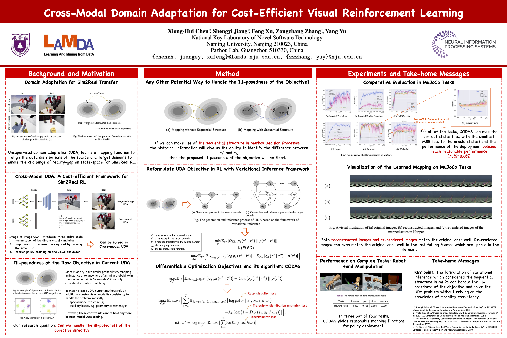
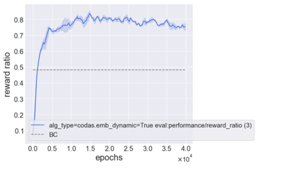

# CODAS
The Official Code for ["Cross-Modal Domain Adaptation for Cost-Efficient Visual Reinforcement Learning"](https://proceedings.neurips.cc/paper/2021/hash/68264bdb65b97eeae6788aa3348e553c-Abstract.html)


Torch version code is available in https://github.com/yixiaoshenghua/CODAS-pytorch
# Code Structure
CODAS

    |- codas: code for CODAS

    |- data: the precollect dataset, pre-trained dynamics model, environments are saved here

    |- mj_envs: environment related code for CODAS

    |- rla_scripts: some scripts to deal with log files

    |- scripts: scripts to run codas

        |- env_config_map.py: task configurations

        |- private.py: configuration for RLA

        |- run_data_collect.py: script to collect data of MuJoCo in the target domain

        |- run_data_collect_robot.py: script to collect data of Hand DAPG in the target domain

        |- run_var_seq.py: script to train codas

    |- rla_config.yaml: configuration for RLA

    |- setup.py: python script to set up environment

# Quick Start
``` shell
# install python environment for CODAS
git clone https://github.com/xionghuichen/RLAssistant
git clone --recursive https://github.com/jiangsy/mj_envs
git clone https://github.com/xionghuichen/CODAS
git clone https://github.com/jiangsy/mjrl
cd RLAssistant
pip install -e .
cd ../mj_envs/
pip install -e .
cd ../mjrl
pip install -e .
cd ../CODAS
pip install -e .

# the working directory is ./scripts
cd scripts

# run data collection in the target domain
python run_data_collect(_robot).py --env_id {task name} # to run data collect in hand DAPG envs, use the run_data_collect_robot.py script
# train codas
python run_var_seq.py --env_id {task_name}
```

We use [RLAssistant](https://github.com/xionghuichen/RLAssistant) to manage our experiments. The training logs can be found in {your CODAS path}/log. You can use tensorbard to check and also use the tools in RLA to visualize (e.g., ```RLA.easy_plot.plot_func.plot_res_func```).
You can check plot_demo.ipynb for more details. The figure of the simplest setting will be something like this:




There are also some scrips in ``./rla_scrips`` to manage the experimental logs. 
